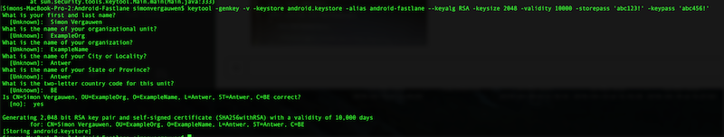

# Android Fastlane

## Initial setup

* Installing fastlane `sudo gem install fastlane --verbose`
* Initializing fastlane for a project
    * Navigate to the project folder
    * `fastlane init`, this will trigger a setup for a basic setup skip automating screengrab and uploading to store

## Creating your own actions

Writing your own actions is out of the scope of this article since it's basically just ruby scripting. It is fairly straight forward if you know basic scripting and use other scripts as inspiration.

In this repo you can find a custom action `jacoco_gradle` that triggers the custom gradle task defined in `jacoco.gradle`.

**There is a bug in GradleAction, and the current workaround is to specifically add `project_dir: "."` when invoking `.run`. A pull request has been made for this issue.**

## Creating a pipeline with Fastlane (Fastfile)

The fastfile is the file where you script the pipeline. A pipeline is a `lane` e.g. `lane :alpha do |options|`.

* To check which lanes are available run `faslane lanes`. In this template the output should like this:

```
--------- android---------
----- fastlane android alpha
Alpha release app. Run checks, test, assemble and upload to Fabric Beta

Execute using `fastlane [lane_name]`
```

* There is only one lane `alpha` which does an alpha release and is the following:
    1. Cleans the project directory (gradle clean)
    2. assembles the apk with a parameterized build number (versionCode) (private lane with specific gradle setup)
    3. Sign the apk (custom fastlane action)
    4. Run checks like Lint, PMD, FindBugs and checkstyle
    5. Run test (gradle test connectedAndroidTest)
    6. Generate JaCoCo reports.
    7. Upload alpha version to Crashlytics BETA (still requires some extra features like release-notes.txt, assigning group)

### Doing an alpha release

* Assembling the apk requires a build number or 0 will be used as build number. This could look something like this `buildnumber:'666` or in Jenkins `buildNumber:'$BUILD_NUMBER'`

* In order to sign an apk we need an keystore so let's generate one.
 


* So when we want to sign the apk we need to pass the path to the keystore, the keypass, the storepass and the alias of the key. Equivalent to `jarsigner` if keypass = storepass than passing the storepass is enough. `storepass:'abc123!' keypass:'abc456!' keystore_path:'android.keystore' alias:'android-fastlane'`

* In order to upload to crashlytics we need to pass an api_token and a build_secret.

==> `fastlane alpha buildNumber:"$BUILD_NUMBER" api_token:'XXXXXX' build_secret:'XXXX' storepass:'abc123!' keypass:'abc456!' keystore_path:' android.keystore' alias:'android-fastlane' `


